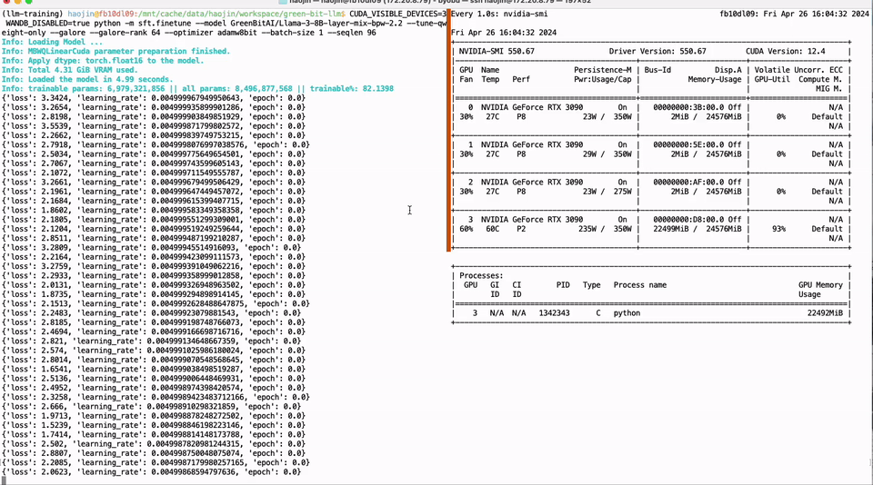
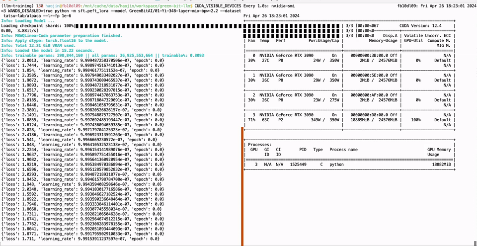

# Green-Bit-LLM

A toolkit for fine-tuning, inferencing, and evaluating GreenBitAI's low-bit LLMs.

## Introduction
 
This Python package uses the [Bitorch Engine](https://github.com/GreenBitAI/bitorch-engine) for efficient operations on [GreenBitAI's Low-bit Language Models (LLMs)](https://huggingface.co/GreenBitAI). 
It enables **high-performance inference** on both cloud-based and consumer-level GPUs, and supports **full-parameter fine-tuning** directly **using quantized LLMs**. 
Additionally, you can use our provided **evaluation tools** to validate the model's performance on mainstream benchmark datasets.

## News
- [2024/04]
  - We have launched over **200 low-bit LLMs** in [GreenBitAI's Hugging Face Model Zoo](https://huggingface.co/GreenBitAI). Our release includes highly precise 2.2/2.5/3-bit models across the LLM family, featuring LLaMA 2/3, 01-Yi, Qwen, Mistral, Phi-3, Gemma, and more.
  - We released [Bitorch Engine](https://github.com/GreenBitAI/bitorch-engine) for **low-bit** quantized neural network operations. Our release support full parameter fine-tuning and parameter efficiency fine-tuning (PEFT), even under extremely constrained GPU resource conditions.
  - We released [gbx-lm](https://github.com/GreenBitAI/gbx-lm) python package which enables the efficient execution of [GreenBitAI's low-bit models](https://huggingface.co/collections/GreenBitAI/greenbitai-mlx-llm-6614eb6ceb8da657c2b4ed58) on Apple devices with [MLX](https://github.com/ml-explore/mlx).  

## LLMs

We have released over 200 highly precise 2.2/2.5/3/4-bit models across the modern LLM family, featuring LLaMA 2/3, 01-Yi, Qwen, Mistral, Phi-3, and more. 

|      Family      |        Bpw         |              Size              |                                                 HF collection_id                                                  |
|:----------------:|:------------------:|:------------------------------:|:-----------------------------------------------------------------------------------------------------------------:|
|     Llama-3      |  `4.0/3.0/2.5/2.2` |            `8B/70B`            | [`GreenBitAI Llama-3`](https://huggingface.co/collections/GreenBitAI/greenbitai-llama-3-6627bc1ec6538e3922c5d81c) |
|     Llama-2      |   `3.0/2.5/2.2`    |          `7B/13B/70B`          | [`GreenBitAI Llama-2`](https://huggingface.co/collections/GreenBitAI/greenbitai-llama-2-661f87e3b073ff8e48a12834) |
|     Qwen-1.5     | `4.0/3.0/2.5/2.2`  | `0.5B/1.8B/4B/7B/14B/32B/110B` | [`GreenBitAI Qwen 1.5`](https://huggingface.co/collections/GreenBitAI/greenbitai-qwen15-661f86ea69433f3d3062c920) |
|      Phi-3       |   `3.0/2.5/2.2`    |             `mini`             |   [`GreenBitAI Phi-3`](https://huggingface.co/collections/GreenBitAI/greenbitai-phi-3-6628d008cdf168398a296c92)   |
|     Mistral      |   `3.0/2.5/2.2`    |              `7B`              | [`GreenBitAI Mistral`](https://huggingface.co/collections/GreenBitAI/greenbitai-mistral-661f896c45da9d8b28a193a8) |
|      01-Yi       |   `3.0/2.5/2.2`    |            `6B/34B`            |   [`GreenBitAI 01-Yi`](https://huggingface.co/collections/GreenBitAI/greenbitai-01-yi-661f88af0648daa766d5102f)   |
| Llama-3-instruct | `4.0/3.0/2.5/2.2`  |            `8B/70B`            | [`GreenBitAI Llama-3`](https://huggingface.co/collections/GreenBitAI/greenbitai-llama-3-6627bc1ec6538e3922c5d81c) |
| Mistral-instruct |   `3.0/2.5/2.2`    |              `7B`              | [`GreenBitAI Mistral`](https://huggingface.co/collections/GreenBitAI/greenbitai-mistral-661f896c45da9d8b28a193a8) |                                                                                                                |
|  Phi-3-instruct  |   `3.0/2.5/2.2`    |             `mini`             |   [`GreenBitAI Phi-3`](https://huggingface.co/collections/GreenBitAI/greenbitai-phi-3-6628d008cdf168398a296c92)   |
|  Qwen-1.5-Chat   | `4.0/3.0/2.5/2.2`  | `0.5B/1.8B/4B/7B/14B/32B/110B` | [`GreenBitAI Qwen 1.5`](https://huggingface.co/collections/GreenBitAI/greenbitai-qwen15-661f86ea69433f3d3062c920) |
|    01-Yi-Chat    |   `3.0/2.5/2.2`    |            `6B/34B`            |   [`GreenBitAI 01-Yi`](https://huggingface.co/collections/GreenBitAI/greenbitai-01-yi-661f88af0648daa766d5102f)   |           

In addition to our low-bit models, green-bit-llm is fully compatible with the AutoGPTQ series of 4-bit quantization and compression models.

## Demo

Full parameter fine-tuning of the LLaMA-3 8B model using a single GTX 3090 GPU with 24GB of graphics memory:



PEFT of the 01-Yi 34B model using a single GTX 3090 GPU with 24GB of graphics memory:



## Installation

We support several ways to install this package.
Except for the docker method, you should first install [Bitorch Engine](https://github.com/GreenBitAI/bitorch-engine)
according to the [official instructions](https://github.com/GreenBitAI/bitorch-engine?tab=readme-ov-file#installation).

Then choose how you want to install it:

### Using Pip

```bash
pip install green-bit-llm
```

### From source

Clone the repository and install the required dependencies (for Python >= 3.9):
```bash
git clone https://github.com/GreenBitAI/green-bit-llm.git
pip install -r requirements.txt
```
Afterward, install [Flash Attention](https://github.com/Dao-AILab/flash-attention) (`flash-attn`) according to their [official instructions](https://github.com/Dao-AILab/flash-attention?tab=readme-ov-file#installation-and-features).

### Conda

Alternatively, you can also use the prepared conda environment configuration:
```bash
conda env create -f environment.yml
conda activate gbai_cuda_lm
```
Afterward, install [Flash Attention](https://github.com/Dao-AILab/flash-attention) (`flash-attn`) according to their [official instructions](https://github.com/Dao-AILab/flash-attention?tab=readme-ov-file#installation-and-features).

Alternatively you can activate an existing conda environment and install the requirements with pip (as shown in the previous section).

### Docker

To use docker, you can also use the provided [Dockerfile](docker/Dockerfile) which extends the [bitorch-engine docker image](https://github.com/GreenBitAI/bitorch-engine/blob/HEAD/docker/README.md).
Build the `bitorch-engine` image first, then run the following commands:
```bash
cd docker
cp -f ../requirements.txt .
docker build -t gbai/green-bit-llm .
docker run -it --rm --gpus all gbai/green-bit-llm
```
Check the [docker readme](docker/README.md) for options and more details.

## Usage
### Inference

Please see the description of the [Inference package](green_bit_llm/inference/README.md) for details.

### Evaluation

Please see the description of the [Evaluation package](green_bit_llm/evaluation/README.md) for details.

### sft

Please see the description of the [sft package](green_bit_llm/sft/README.md) for details.

## Requirements

- Python 3.x
- [Bitorch Engine](https://github.com/GreenBitAI/bitorch-engine)
- See `requirements.txt` or `environment.yml` for a complete list of dependencies

## Examples

### Simple Generation

Run the simple generation script as follows:

```bash
CUDA_VISIBLE_DEVICES=0 python -m green_bit_llm.inference.sim_gen --model GreenBitAI/Qwen-1.5-1.8B-layer-mix-bpw-3.0 --max-tokens 100 --use-flash-attention-2 --ignore-chat-template
```

### PPL Evaluation
```bash
CUDA_VISIBLE_DEVICES=0 python -m green_bit_llm.evaluation.evaluate --model GreenBitAI/Qwen-1.5-4B-layer-mix-bpw-3.0 --trust-remote-code --eval-ppl --ppl-tasks wikitext2,c4_new,ptb
```

### Full-parameter fine-tuning

Run the script as follows to fine-tune the quantized weights of the model on the target dataset. 
The '--tune-qweight-only' parameter determines whether to fine-tune only the quantized weights or all weights, including non-quantized ones.

```bash
CUDA_VISIBLE_DEVICES=0 python -m green_bit_llm.sft.finetune --model GreenBitAI/Qwen-1.5-1.8B-layer-mix-bpw-3.0 --dataset tatsu-lab/alpaca --optimizer DiodeMix --tune-qweight-only

# AutoGPTQ model Q-SFT
CUDA_VISIBLE_DEVICES=0 python -m green_bit_llm.sft.finetune --model astronomer/Llama-3-8B-Instruct-GPTQ-4-Bit --dataset tatsu-lab/alpaca --tune-qweight-only --batch-size 1
```

### Parameter efficient fine-tuning

```bash
CUDA_VISIBLE_DEVICES=0 python -m green_bit_llm.sft.peft_lora --model GreenBitAI/Qwen-1.5-1.8B-layer-mix-bpw-3.0 --dataset tatsu-lab/alpaca --lr-fp 1e-6

# AutoGPTQ model with Lora
CUDA_VISIBLE_DEVICES=0 python -m green_bit_llm.sft.peft_lora --model astronomer/Llama-3-8B-Instruct-GPTQ-4-Bit --dataset tatsu-lab/alpaca --lr-fp 1e-6
```

## License
We release our codes under the [Apache 2.0 License](LICENSE).
Additionally, three packages are also partly based on third-party open-source codes. For detailed information, please refer to the description pages of the sub-projects.
